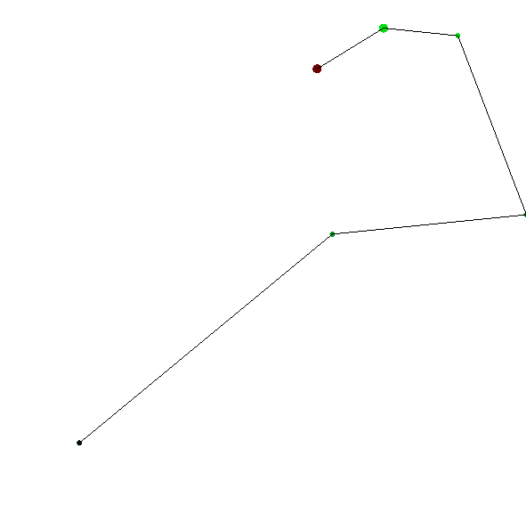

# gym-trajectory
Custom environment for OpenAI gym

```pip install gym-trajectory```

N-dimensional trajectory


```py
import gym
import gym_trajectory

env = gym.make('Trajectory-v0')
observation = env.reset()

while True:
    (observation, reward, done, info) = env.step(env.action_space.sample())
    env.render()
```


